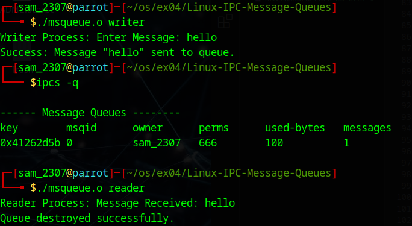

# Linux-IPC-Message-Queues
Linux IPC-Message Queues

# AIM:
To write a C program that receives a message from message queue and display them

# DESIGN STEPS:
### Step 1:

Navigate to any Linux environment installed on the system or installed inside a virtual environment like virtual box/vmware or online linux JSLinux (https://bellard.org/jslinux/vm.html?url=alpine-x86.cfg&mem=192) or docker.

### Step 2:

Write the C Program using Linux message queues API 

### Step 3:

Execute the C Program for the desired output. 

# PROGRAM:

## C program that receives a message from message queue and display them
```#include <stdio.h>
#include <stdlib.h>
#include <string.h>
#include <sys/ipc.h>
#include <sys/msg.h>
#include <errno.h>

// Structure for message queue
struct mesg_buffer {
    long mesg_type;
    char mesg_text[100];
} message;

int main(int argc, char *argv[]) {
    key_t key;
    int msgid;

    if (argc != 2) {
        fprintf(stderr, "Usage: %s <writer|reader>\n", argv[0]);
        return 1;
    }

    // Generate unique key using ftok
    // Ensure "progfile" exists in the directory or use "."
    key = ftok(".", 65); 
    if (key == -1) {
        perror("ftok failed");
        return 1;
    }

    // Create or access the message queue
    msgid = msgget(key, 0666 | IPC_CREAT);
    if (msgid == -1) {
        perror("msgget failed");
        return 1;
    }

    if (strcmp(argv[1], "writer") == 0) {
        message.mesg_type = 1;
        printf("Writer Process: Enter Message: ");
        fgets(message.mesg_text, sizeof(message.mesg_text), stdin);
        
        // Remove trailing newline
        message.mesg_text[strcspn(message.mesg_text, "\n")] = 0;

        // msgsnd: (id, ptr, size of data, flags)
        if (msgsnd(msgid, &message, sizeof(message.mesg_text), 0) == -1) {
            perror("msgsnd failed");
            return 1;
        }
        printf("Success: Message \"%s\" sent to queue.\n", message.mesg_text);

    } else if (strcmp(argv[1], "reader") == 0) {
        // msgrcv: (id, ptr, size of data, type, flags)
        if (msgrcv(msgid, &message, sizeof(message.mesg_text), 1, 0) == -1) {
            perror("msgrcv failed");
            return 1;
        }
        printf("Reader Process: Message Received: %s\n", message.mesg_text);

        // Remove the queue from the system
        if (msgctl(msgid, IPC_RMID, NULL) == -1) {
            perror("msgctl RMID failed");
        } else {
            printf("Queue destroyed successfully.\n");
        }

    } else {
        printf("Invalid mode. Use 'writer' or 'reader'.\n");
    }

    return 0;
}
```


## OUTPUT:

# RESULT:
The programs are executed successfully.
